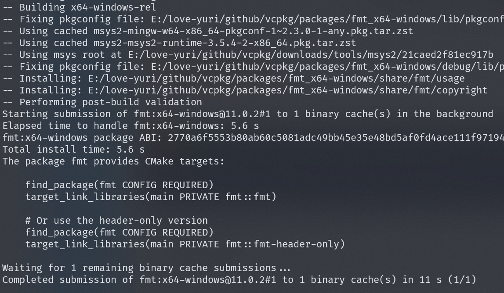

# CMake 集成vcpkg

## 安装vcpkg

1. 安装

```bash
git clone https://github.com/microsoft/vcpkg.git
cd vcpkg
.\bootstrap-vcpkg.bat
```

2. 添加到环境变量(可选)
3. 全局安装为库(可选) ： `vcpkg integrate install` MSBuild工具可以直接使用。

## CMkake集成

1. 安装库： `vacpkg install [库名称]`

   

2. 添加vcpkg-root的目录， 需要在设置project前设置

   ```cmake
   set(VCPKG_ROOT "E:/love-yuri/github/vcpkg")
   set(CMAKE_TOOLCHAIN_FILE "${VCPKG_ROOT}/scripts/buildsystems/vcpkg.cmake" CACHE STRING "")
   ```

3. CMake文件中查找需要的库: `find_package(cppzmq CONFIG REQUIRED)` : 如果不知道查找库的名称可以看看装后的提示

4. 在可执行目标后面链接库: `target_link_libraries(${PROJECT_NAME} PRIVATE cppzmq cppzmq-static)` 

5. 编译运行即可