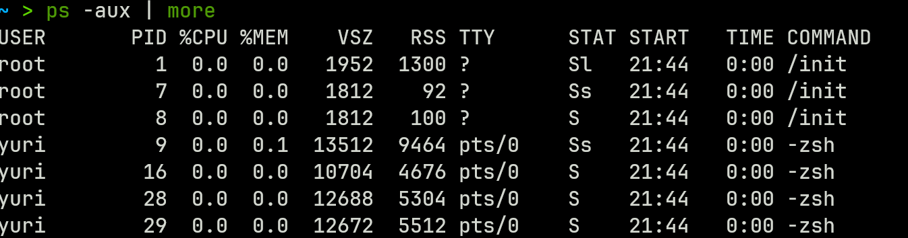

# Linux 内核学习

> 主力学习进程调度方向

## 快速入门

### 安装

```bash
git clone --depth 1 https://github.com/torvalds/linux.git # 直接克隆地址

# fork自己仓库然后克隆
```

### 目录结构

1. **arch**：存储特定体系结构的架构相关代码，例如x86、ARM、MIPS等。
2. **block**：包含块设备相关的代码，例如硬盘、SSD等块设备的驱动。
3. **certs**：存储内核代码签名和认证相关的证书和密钥。
4. **crypto**：包含加密算法和密码学库相关的代码，用于提供安全性和加密功能。
5. **Documentation**：存储内核文档，包括开发者文档、配置选项说明、子系统概述等。
6. **drivers**：包含设备驱动程序，用于支持各种硬件设备，如显卡、网卡、声卡等。
7. **fs**：**VFS 子系统**：虚拟文件系统（Virtual File System，简称 VFS）的代码，用于统一管理各种文件系统和文件操作。
8. **include**：存储头文件，包含内核代码中需要包含的C语言头文件。
9. **init**：包含内核初始化和启动代码，这是内核启动时的入口点。
10. **ipc**：存储进程间通信（IPC）相关的代码，如消息队列、信号量等。
11. **kernel**：包含内核的核心代码，涵盖进程管理、内存管理、调度等核心操作系统功能。
12. **lib**：存储内核中通用的实用程序和库函数，用于各个子系统。
13. **LICENSES**：包含内核中使用的各种开源许可证的文本文件。
14. **mm**：存储内存管理相关的代码，包括页表管理、内存分配、交换等。
15. **net**：存储网络协议栈和网络设备驱动程序相关的代码。
16. **samples**：包含示例代码和演示如何使用内核API的示例程序。
17. **scripts**：存储用于内核构建、配置和维护的脚本。
18. **security**：包含安全子系统相关的代码，如SELinux、AppArmor等。
19. **sound**：存储声音子系统相关的代码，用于支持音频设备。
20. **tools**：包含用于内核开发的实用工具和脚本。
21. **usr**：包含用户空间工具，用于与内核进行交互。
22. **CREDITS**：包含对内核贡献者的感谢列表。
23. **Kbuild**：包含内核构建系统的配置文件和规则。
24. **Kconfig**：包含内核配置选项的定义，用于配置编译选项。
25. **Makefile**：包含内核的顶层Makefile，用于构建内核。
26. **COPYING**：包含Linux内核的版权声明和使用条款。
27. **MAINTAINERS**：包含内核子系统的维护者列表和联系信息。

# 进程调度学习

## 基础概念

- 进程是 应用程序加载到内存中执行才叫做进程，不然只能叫做程序不能叫做进程。
- 进程只有执行了才叫做进程。进程的物理基础是程序。
- 进程是运行中程序，进程是OS分配内存，cpu时间片等资源的基本单位。
- 进程是实现cpu并发的一个实体，实现对cpu的虚拟化，让每个继承都拥有cpu。

## 查看进程

### PS命令

```bash
ps -aux | grep init
```



1. `USER` 用户名称
1. `PID` 进程编号
1. `%CPU` 进程占用cpu 百分比
1. `MEM` 进程占用内存 百分比
1. `VSZ` 进程所占用的虚拟内存的大小 单位(KB)
1. `RSS` 进程所占用的物理内存的大小 单位(KB)
1. `TTY` 终端名称
1. `STAT` 进程状态
1. `START` 进程的启动时间
1. `TIME` 进程使用cpu的总时间
1. `COMMAND` 启动进程所用的命令和参数

## 数据结构

### PCB

> 程序控制器 每个进程对资源拥有的抽象叫做 PCB 进程控制块(process control block)

包含

1. 当前运行状态
2. 程序计数器
3. cpu调度信息
4. cpu寄存器
5. 内存管理信息

### task_struct

> linux 内核使用task_struct来描述程序控制器


# 常见数据解析

> 数据来源ChatGpt 3.5 模型

## 编译选项

> 头文件 `include/linux/sched.h`

### CONFIG_PREEMPT_RT

`CONFIG_PREEMPT_RT` 是一个用于 Linux 内核的配置选项，它与实时（Real-Time）性能相关。这个选项通常用于启用 Linux 实时内核（Real-Time Kernel）的支持。

实时内核是为了满足实时性要求而特别设计的内核变种。与通常的 Linux 内核不同，实时内核能够在固定的时间内响应外部事件，确保任务能够按时执行，而不受其他任务的影响。这对于需要精确控制执行时间的应用程序非常重要，如工业自动化、机器人控制、医疗设备等。

`CONFIG_PREEMPT_RT` 选项的作用是启用或禁用 Linux 实时补丁（Real-Time Patch）或针对实时性能的改进。这个选项的启用会导致内核采取一系列措施来减小内核的响应时间和延迟，以提高实时性能。这些改进包括：

1. **抢占性内核**：实时内核允许更频繁地抢占正在执行的任务，以响应更高优先级的任务。这降低了任务被其他任务阻塞的可能性，从而减小了响应时间。
2. **调度器改进**：实时内核的调度器被改进，以更好地满足实时性要求。它可以更准确地控制任务的执行顺序，确保高优先级任务得到更快的响应。
3. **中断处理改进**：实时内核优化了中断处理的机制，以减小中断处理的延迟。
4. **内核锁的优化**：实时内核减小了内核锁的持有时间，以避免锁竞争造成的延迟。

总之，`CONFIG_PREEMPT_RT` 是用于启用 Linux 实时内核支持的配置选项。启用实时内核可以显著提高 Linux 内核的实时性能，使其适用于需要高精度响应的实时应用。但是需要注意的是，配置和构建一个实时内核可能需要深入的内核知识，并且在不同的硬件和应用场景下需要进行仔细的调整和测试。

### CONFIG_THREAD_INFO_IN_TASK

`CONFIG_THREAD_INFO_IN_TASK` 是 Linux 内核配置选项之一，用于控制 Linux 内核中线程信息存储的方式。具体来说，它决定了线程信息是否存储在任务结构（task_struct）中。

在 Linux 内核中，每个正在运行的进程或线程都有一个相关联的任务结构（task_struct），它包含了有关该任务的各种信息，如进程ID、进程状态、进程优先级等。`task_struct` 是一个非常重要的数据结构，用于描述和管理正在运行的任务。

`CONFIG_THREAD_INFO_IN_TASK` 的作用是决定线程信息（Thread Info）的存储位置：

- 如果 `CONFIG_THREAD_INFO_IN_TASK` 被禁用（未定义），线程信息将存储在内核堆栈中。
- 如果 `CONFIG_THREAD_INFO_IN_TASK` 被启用（定义），线程信息将存储在任务结构（task_struct）中。

将线程信息存储在任务结构中的主要优势是提高了访问线程信息的效率，因为不需要额外的内存分配和释放操作。这对于在内核中频繁访问线程信息的操作来说可以提高性能。

但是，要注意在某些情况下，线程信息存储在任务结构中可能会增加任务结构的大小，因此可能会占用更多的内存。因此，是否启用 `CONFIG_THREAD_INFO_IN_TASK` 取决于系统的需求和性能优化目标。

总之，`CONFIG_THREAD_INFO_IN_TASK` 是一个用于控制线程信息存储位置的内核配置选项，可以根据系统的需求来选择是否启用。

## 常量

1. #### **`TASK_INTERRUPTIBLE`**（可中断睡眠）：

   - 当任务处于 `TASK_INTERRUPTIBLE` 状态时，它在等待某些条件满足时会进入睡眠状态。
   - 这意味着任务在等待时可以响应信号，例如可以通过信号唤醒。它允许任务响应中断请求。
   - 通常用于等待条件变量或等待某个事件发生的情况。

2. **`TASK_UNINTERRUPTIBLE`**（不可中断睡眠）：

   - 当任务处于 `TASK_UNINTERRUPTIBLE` 状态时，它也在等待某些条件满足时进入睡眠状态。
   - 与 `TASK_INTERRUPTIBLE` 不同，这个状态表示任务不会响应信号，即使收到中断信号（如 `SIGKILL`）也不会唤醒它。
   - 通常用于对于不可恢复的等待情况，例如文件系统操作，其中不能被信号中断。

1. **`TASK_INTERRUPTIBLE`**（可中断睡眠）：
   - 当任务处于 `TASK_INTERRUPTIBLE` 状态时，它在等待某些条件满足时会进入睡眠状态。
   - 这意味着任务在等待时可以响应信号，例如可以通过信号唤醒。它允许任务响应中断请求。
   - 通常用于等待条件变量或等待某个事件发生的情况。
   
2. **`TASK_UNINTERRUPTIBLE`**（不可中断睡眠）：
   
   - 当任务处于 `TASK_UNINTERRUPTIBLE` 状态时，它也在等待某些条件满足时进入睡眠状态。
   - 与 `TASK_INTERRUPTIBLE` 不同，这个状态表示任务不会响应信号，即使收到中断信号（如 `SIGKILL`）也不会唤醒它。
   - 通常用于对于不可恢复的等待情况，例如文件系统操作，其中不能被信号中断。
   
5. **`EXIT_DEAD`**（任务已退出但尚未删除）：任务已经退出，但尚未被系统完全删除。通常用于等待其他进程完成对该任务的清理工作。

6. **`EXIT_ZOMBIE`**（僵尸任务）：任务已退出，但其父进程尚未获取其退出状态。僵尸进程等待其父进程来调用 `wait()` 或 `waitpid()` 来获取其退出状态。

7. **`EXIT_TRACE`**（退出跟踪）：由于其值是 `EXIT_ZOMBIE` 与 `EXIT_DEAD` 的按位或，表示任务既是僵尸任务又已退出。

8. **`TASK_PARKED`**（任务已停滞）：任务已停滞，等待某些条件满足。通常用于进程等待事件发生的情况。

9. **`TASK_DEAD`**（任务已死亡）：任务已死亡，不再存在。

10. **`TASK_WAKEKILL`**（任务唤醒后立即杀死）：如果任务在唤醒后会被杀死，则设置此标志。

11. **`TASK_WAKING`**（任务正在唤醒）：任务正在从休眠状态中被唤醒。

12. **`TASK_NOLOAD`**（任务不会被加载）：任务将不会被加载，通常在某些特殊情况下使用。

13. **`TASK_NEW`**（新任务）：任务是新创建的。

14. **`TASK_RTLOCK_WAIT`**（实时锁等待）：任务正在等待实时锁。

15. **`TASK_FREEZABLE`**（可冻结任务）：任务可以被冻结，通常与冻结机制一起使用。

16. **`__TASK_FREEZABLE_UNSAFE`**（不安全的可冻结任务标志位）：用于表示不安全的可冻结任务。

17. **`TASK_FROZEN`**（任务已冻结）：任务已被冻结，不再响应外部事件。

18. **`TASK_STATE_MAX`**（任务状态的最大值）：表示任务状态的最大值，通常不会超过此值。

19. **`TASK_ANY`**（任何任务）：表示任何任务状态，通常用于某些查询操作。
